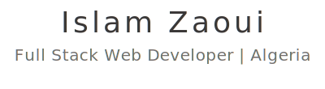

  <picture>
    <source media="(prefers-color-scheme: dark)" srcset="header-dark.svg" />
    
  </picture>

## 🚀 About Me  

- 🎓 Graduated in Computer Science from the University of M'sila  
- 💻 Full-stack web developer with **1+ year** of experience  
- 🔥 Passionate about programming, web security, and optimizing performance  
- 📚 Always learning and experimenting with new technologies  
- 🌐 Check out my portfolio: [islamzaoui.top](https://islamzaoui.top)  

## 🛠️ Technologies & Tools  

  

## 📬 Get in Touch  

  
  
  
  

